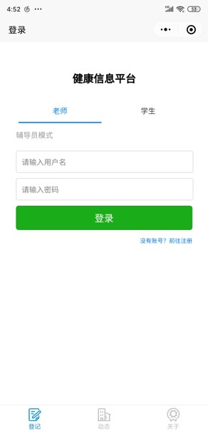
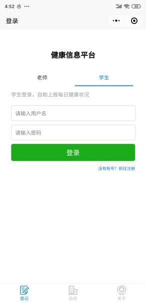
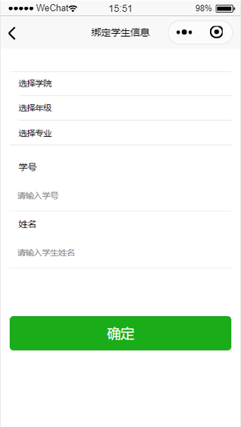
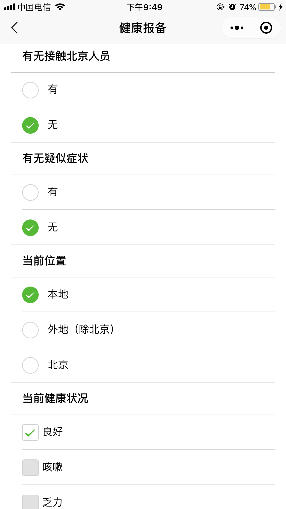
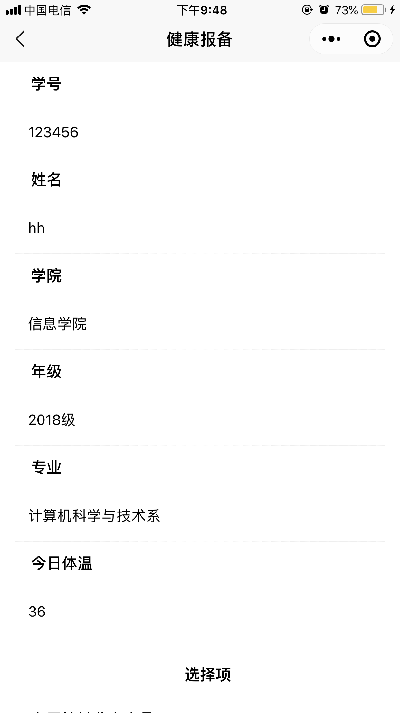
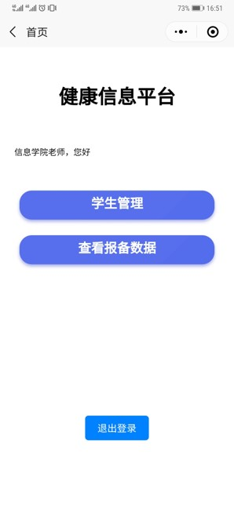
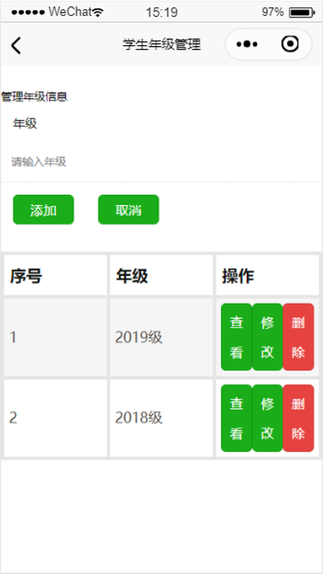
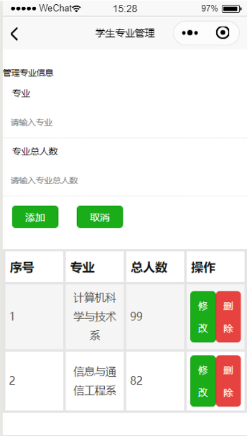
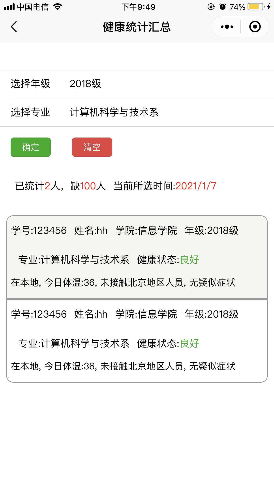
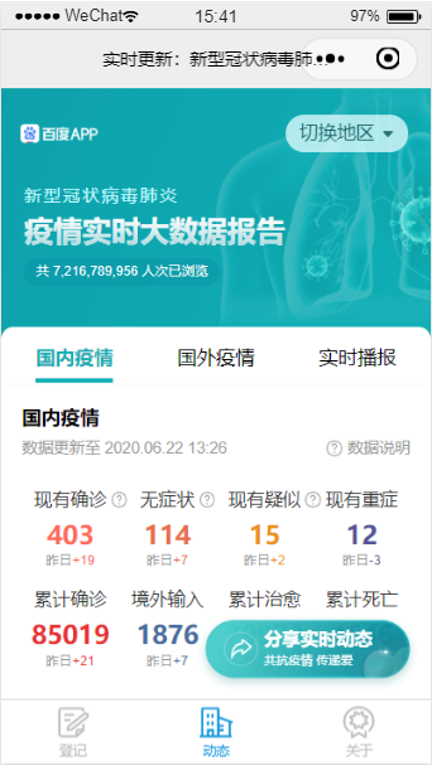

# SmartHealth

A full-stack application for managing and reporting students' health information during Covid-19 pandemic.

## Getting Started

These instructions will get you a copy of the project up and running on your local machine for development and testing purposes.

### Prerequisites

- [HBuilderX 2.5.8(Alpha Version)](https://www.dcloud.io/hbuilderx.html) - Develop tool
- [uniCloud](https://unicloud.dcloud.net.cn/pages/login/login)- js developing sever

### Setting
- In `main.js`, set the space's `spaceId` and `clientSecret`; 
- In `manifest.json`, set the WeChat mini program's `appID`, otherwise the code obtained on WeChat will be `the code is a mock one`; 
- In `cloudfunctions-dev/src/utils/constants.js`, set `AppId`, `AppSecret`, and `passSecret` fields, otherwise `openid` cannot be obtained."

### Installing

1. The project requires [registration](https://dev.dcloud.io/#/pages/common/register) and the activation of uniCloud, due to the review requirements of Alibaba Cloud, real-name certification is required.

2. Clone the repository.

3. After cloning the project source code, right-click on the `cloudfunctions` directory and select your service space. 
   - If you do not have a service space, you need to create one, and the process will guide you through logging in and registering for `uniCloud`.

4. Once the service space is set up, please refer to the [db.md](db.md) file in the project and create the corresponding tables in your cloud database.
   - The specific method is to right-click on the `cloudfunctions` directory, open the uniCloud web console, and in the cloud database interface, click "New Table", and create all the table names mentioned in [db.md](db.md) one by one.

5. Right-click on each cloud function (folder), then select `upload and deploy` to your service space.

6. Change the `DCloud_AppID` in `manifest.json` according your own `DCloud_AppID`.

7. Finally, you can run it. 
    - `Windows version`: you can run it directly in the built-in browser. 
    - `Mac version`: the built-in browser also has cross-domain problems, you need to run it on the mini program simulator or app. Otherwise you need to install a [cross-domain plugin](https://ask.dcloud.net.cn/article/35267) for the Mac external browser.

## Built With

- [uni-app](https://en.uniapp.dcloud.io/)
- [uniCloud](https://unicloud.dcloud.net.cn/pages/login/login)
- [Vue.js](https://vuejs.org/)
- [JavaScript](https://www.javascript.com/)

- `Front-end`: Developed based on the uni-app framework, which is a multi-end framework that writes all platform applications using vue.js. You need to understand uni-app in order to customize it more deeply. For detailed documentation of uni-app, see: [https://uniapp.dcloud.io/README](https://uniapp.dcloud.io/README)

- `Back-end`: Based on uniCloud, which is a cloud development mode based on js, similar to the cloud development of WeChat and Alipay mini programs, but can be used cross-platform. It is based on the serverless model and has many advantages. It is recommended that developers read through the introduction and quick start of uniCloud to facilitate. For detailed documentation of uniCloud see: [https://uniapp.dcloud.io/uniCloud/README](https://uniapp.dcloud.io/uniCloud/README)

## Authors

- **Yanan Wang** - *Initial work* - [a123wyn](https://github.com/a123wyn)
- **Hong Hong** - *Initial work* - [honghong1012](https://github.com/honghong1012)
- **Huiting Xu** - *Initial work* - [thera0810](https://github.com/thera0810)

## License

This project is licensed under the MIT License - see the [LICENSE.md](LICENSE.md) file for details

# Screenshots

## Login Page

Students can register on this page. And the teachers' data are currently saved in the background database.

Teacher's tab: 
Username: 信息学院  Password:12345678 
Username: 电子科学与技术学院 Password:12345678 

Student's tab: 

## Students' Port
After entering the student port, students can register and bind their student information (e.g. college, year, major number, name) to be managed by the teacher later。

Once you have bound your information, you can enter the daily health information registration screen to register your temperature and other health information.

## Teachers' Port
After entering the teacher port, teachers can manage the list of students and view the total data reported by students.

When managing the list of students, you can view, modify, delete, etc. the classes/grades of the students you manage.

When viewing the status of student reporting, you can select the appropriate class/grade level to view real-time student information reporting。

## Real-time Pandemic Status
In addition, you can also view the national and global real-time epidemic status in the login screen to understand the real-time situation of the epidemic. 
  - This module uses the online interface and uses reverse proxy to achieve page jumping, but because the non-enterprise applet cannot use the business domain name of reverse proxy, the experience version cannot show the real-time information of the epidemic dynamics, the screenshot is taken from the preview of the developer tool.

